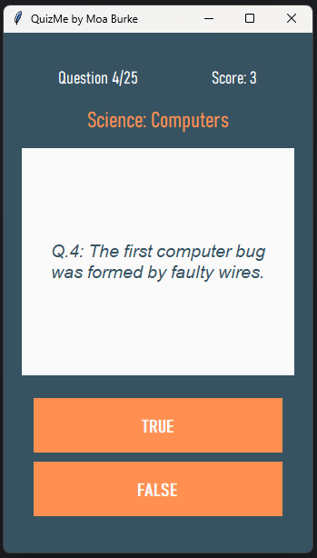

# QuizMe

QuizMe is an interactive quiz application built using Python and Tkinter. It fetches quiz questions from the Open Trivia Database and presents them to the user in a fun and engaging way. Users can answer true or false questions and keep track of their scores.




## Features

- Dynamic question fetching from the Open Trivia Database API
- Supports true/false questions
- Displays the current score and question number
- User-friendly graphical interface using Tkinter
- Customizable quiz settings (category and number of questions)

## Technologies Used

- Python 3
- Tkinter (for the GUI)
- Requests (for API calls)
- Open Trivia Database (for quiz questions)

## Installation

To run this project, ensure you have Python installed on your computer. You can download Python from [python.org](https://www.python.org/).

- **Note**: Tkinter is included with most Python installations. No additional installation is required for Tkinter.

1. **Clone the Repository**:
   ```bash
   git clone https://github.com/moaburke/QuizMe.git
   ```
2. **Navigate to the project directory**:
   ```bash
   cd QuizMe
   ```
3. **Install required packages**:
   ```bash
    pip install requests
   ```

## Usage

1. **Open the Terminal and navigate to project directory.** (Command Prompt or PowerShell on Windows, Terminal on macOS/Linux).

2. **Run the Game:**
   - Execute the game using the command:
     ```bash
     python main.py
     ```
   - If you receive an error indicating that Python is not recognized, ensure Python is installed and added to your PATH. You can verify by running `python --version`.

